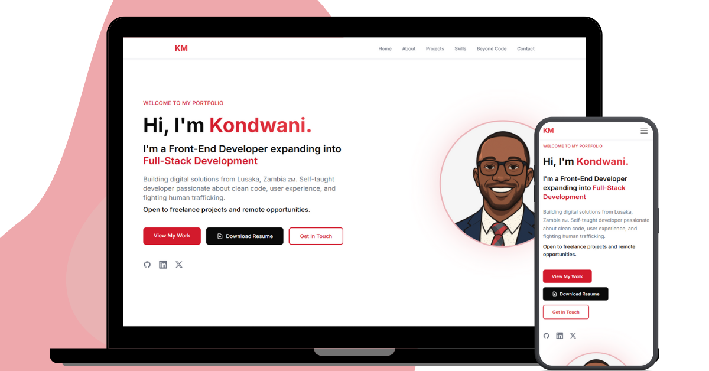

# 🌟 Kondwani Muwowo - Portfolio

> A modern, minimal portfolio showcasing my journey as a Front-End Developer & UI Designer from Lusaka, Zambia.



[](https://kondwanimuwowo.com)
[](https://github.com/kondwanimuwowo)
[](https://linkedin.com/in/kondwanimuwowo)

---

## 📖 About This Project

This is my personal portfolio website, built to showcase my skills, projects, and journey in software development. The site reflects my commitment to clean code, intuitive design, and user-centered experiences.

**Live Site:** [kondwanimuwowo.com](https://kondwanimuwowo.com)

---

## ✨ Features

### 🎯 Core Sections

- **Hero Section** - Eye-catching introduction with CTA buttons
- **About** - My journey from Chingola to code, with expandable story
- **Projects** - Showcase of real-world applications with live demos
- **Skills** - Interactive tech stack with icons and detailed skill levels
- **Beyond Code** - Humanitarian work with TAKUZA and entrepreneurial ventures
- **Contact** - Easy ways to get in touch

### 🎨 Design & UX

- ✅ Minimal, modern design with red/white/black color scheme
- ✅ Fully responsive (mobile-first approach)
- ✅ Smooth animations and hover effects
- ✅ Optimized images and performance
- ✅ Accessible with semantic HTML and ARIA labels

### ⚡ Technical Highlights

- Built with **React 18** and **Vite** for blazing-fast performance
- **Tailwind CSS** for utility-first styling
- **React Icons** for scalable icon system
- **ESLint** for code quality
- Deployed via **GitHub Pages** with **Cloudflare** CDN

---

## 🛠️ Technologies Used

### Frontend


### Tools & Build


### Design


---

## 📂 Project Structure

```
kondwani-portfolio/
├── public/
│   ├── images/
│   │   ├── logos/              # Brand logos (TAKUZA, Smile FX)
│   │   └── projects/           # Project screenshots
│   ├── kondwani.png           # Profile image
│   └── resume.pdf             # Downloadable resume
├── src/
│   ├── components/
│   │   ├── Header/            # Navigation component
│   │   ├── Hero/              # Landing section
│   │   ├── About/             # Bio with expandable content
│   │   ├── Projects/          # Project showcase cards
│   │   ├── Skills/            # Tech stack with icons
│   │   ├── BeyondCode/        # Additional ventures
│   │   ├── Contact/           # Contact form & links
│   │   └── Footer/            # Site footer
│   ├── data/
│   │   ├── projects.js        # Project data
│   │   ├── skills.js          # Skills & tech stack
│   │   └── beyondCode.js      # Additional info
│   ├── App.jsx                # Main app component
│   ├── index.css              # Global styles & Tailwind
│   └── main.jsx               # Entry point
├── .gitignore
├── eslint.config.js
├── index.html
├── package.json
├── tailwind.config.js         # Tailwind configuration
├── vite.config.js             # Vite configuration
└── README.md
```

---

## 🚀 Getting Started

### Prerequisites

Ensure you have the following installed:

- **Node.js** (v16 or higher)
- **npm** (v8 or higher) or **yarn**

### Installation

1. **Clone the repository**

```bash
   git clone https://github.com/kondwanimuwowo/kondwani-portfolio.git
   cd kondwani-portfolio
```

2. **Install dependencies**

```bash
   npm install
   # or
   yarn install
```

3. **Start development server**

```bash
   npm run dev
   # or
   yarn dev
```

4. **Open in browser**

   Navigate to `http://localhost:5173`

---

## 📦 Build & Deployment

### Build for Production

```bash
npm run build
```

This creates an optimized production build in the `dist/` folder.

### Preview Production Build

```bash
npm run preview
```

### Deployment

This portfolio is deployed using:

- **GitHub Pages** for hosting
- **Cloudflare** for CDN and DNS management
- **Custom domain:** [kondwanimuwowo.com](https://kondwanimuwowo.com)

To deploy your own version:

```bash
npm run build
# Push the dist folder to your hosting provider
```

---

## 🎨 Customization

### Colors

The color palette is defined in `tailwind.config.js`:

```javascript
colors: {
  light: '#FFFFFF',
  'light-secondary': '#F5F5F5',
  dark: '#0A0A0A',
  red: '#DC2626',
  'red-hover': '#EF4444',
  gray: '#6B7280',
}
```

### Content

All content is stored in data files for easy updates:

- **Projects:** `src/data/projects.js`
- **Skills:** `src/data/skills.js`
- **Beyond Code:** `src/data/beyondCode.js`

---

## 🧪 Code Quality

### Linting

```bash
npm run lint
```

### Code Style

- ESLint configuration for React
- Prettier (optional) for consistent formatting
- Component-based architecture
- Clean, readable code with comments

---

## 🌱 Future Enhancements

- [ ] Dark mode toggle
- [ ] Blog section for technical articles
- [ ] Framer Motion animations
- [ ] Project filtering by technology
- [ ] Contact form with email integration
- [ ] Performance optimizations
- [ ] More project case studies

---

## 🤝 Contributing

While this is a personal portfolio, I'm open to suggestions! If you find any bugs or have ideas for improvements:

1. Fork the repository
2. Create a feature branch (`git checkout -b feature/AmazingFeature`)
3. Commit your changes (`git commit -m 'Add some AmazingFeature'`)
4. Push to the branch (`git push origin feature/AmazingFeature`)
5. Open a Pull Request

---

## 📄 License

This project is licensed under the **MIT License** - see the [LICENSE](LICENSE) file for details.

You're free to use this code as inspiration for your own portfolio, but please:

- Don't directly copy my personal content
- Give credit where appropriate
- Make it your own!

---

## 📬 Contact

**Kondwani Muwowo**

- 🌐 Website: [kondwanimuwowo.com](https://kondwanimuwowo.com)
- 💼 LinkedIn: [linkedin.com/in/kondwanimuwowo](https://linkedin.com/in/kondwanimuwowo)
- 🐙 GitHub: [@kondwanimuwowo](https://github.com/kondwanimuwowo)
- 🐦 X/Twitter: [@kondwanimuwow0](https://x.com/kondwanimuwow0)
- 📧 Email: kondwanimuwowo@gmail.com

---

## 🙏 Acknowledgments

- **React Team** - For the amazing framework
- **Tailwind CSS** - For the utility-first CSS framework
- **Vite** - For the lightning-fast build tool
- **React Icons** - For the comprehensive icon library
- **TAKUZA/Love Justice International** - For the humanitarian work opportunity
- **The Great Achievers Network** - For trusting me with their website

---

## 💡 About Me

I'm a self-taught Front-End Developer & UI Designer from Lusaka, Zambia 🇿🇲. I'm passionate about building digital solutions that make a difference. When I'm not coding, I'm fighting human trafficking as a Transit Monitor with TAKUZA, training forex traders, or staying active at the gym.

**Currently open to:**

- Freelance projects
- Remote opportunities
- Front-end roles
- Purpose-driven companies

Let's build something amazing together! 🚀

---

<div align="center">

**⭐ Star this repo if you found it helpful!**

Made with ❤️ in Lusaka, Zambia

</div>
```
